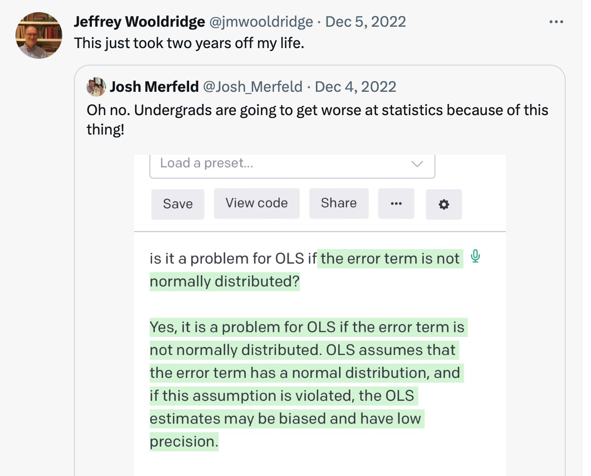

# Chat GPT is awesome but be careful as it can makeup the fact

ChatGPT is a really cool chatbot uing natural Language Processing model developed by OpenAI. You may have heard alot about or used chatGPT lately. I have been using it for quite some time now and I have to say it's amazing. I started using it out of curiosity and now I use it regularly to enhance my writing skills. I was even surprised to see that it can quickly write simple R codes.

ChatGPT is indeed a game changer and has sparked an AI war among major tech companies. On February 10th, Google launched a demo of new AI chatbot tool Bard, but it failed to provide the correct answer to a knowledge-based question [link]( https://edition.cnn.com/2023/02/08/tech/google-ai-bard-demo-error/index.html). This reminded me of a tweet I saw in early December, where ChatGPT answered a statistical question incorrectly (picture attached). I even tried it again recently and the answer was a bit different, but still incorrect :D.

{width=50%}

The point is, chatGPT can answer very confidently and use all the right statistical terms, but it can still be misleading if you don't have a good understanding of statistics. That's why it's important to be cautious when relying on chatGPT for information and should verify the answers it provides.

The leader of OpenAI, Mira Murati, said in an interview with [Business Insider](https://www.businessinsider.com/chatgpt-may-make-up-facts-openai-cto-mira-murati-says-2023-2) that ChatGPT and other AI tools like it might not always be right. So, it's important to be careful when using AI tools like ChatGPT and make sure the information is correct.

